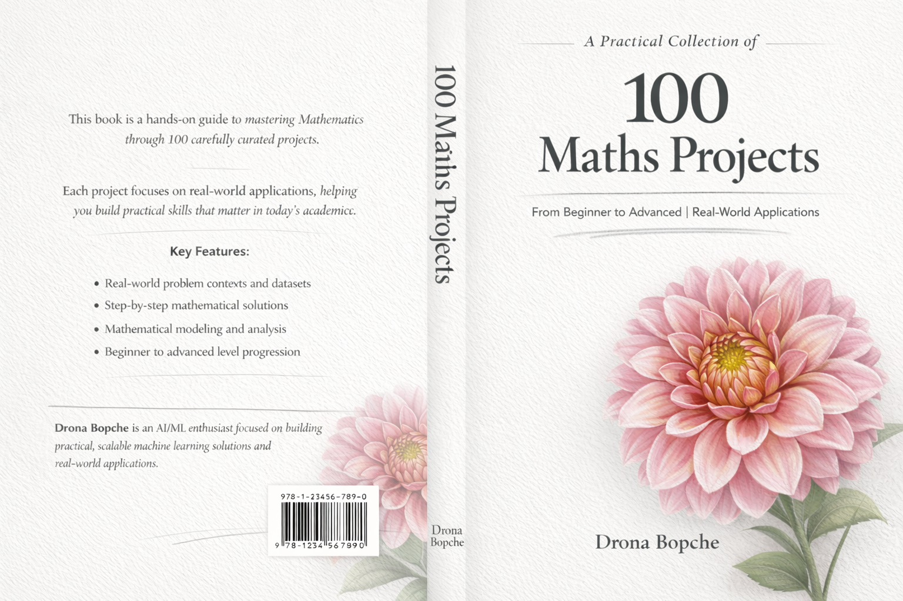

# 100 Math Projects — Computer Science Edition

A comprehensive collection of 100 mathematical projects implemented in Python Jupyter Notebooks, covering algorithms, number theory, fractals, signal processing, statistics, and more.

<p align="center">
    
</p>

## Structure

Each project folder contains:
```
XX_project_name/
├── notebook.ipynb     ← Main Jupyter notebook with code & explanations
└── resources/         ← Output images, datasets, reference files
    └── README.md
```

## Project Index

| # | Project | Category |
|---|---------|----------|
| 01 | Sorting Algorithms Visualizer | Algorithms |
| 02 | Prime Number Generator | Number Theory |
| 03 | Matrix Transformation Visualizer | Linear Algebra |
| 04 | Fourier Series Visualizer | Signal Processing |
| 05 | Pi Monte Carlo Simulator | Probability |
| 06 | Fibonacci Sequence Explorer | Number Theory |
| 07 | Euclidean Algorithm GCD | Number Theory |
| 08 | Sieve of Eratosthenes | Number Theory |
| 09 | Binary Search Visualizer | Algorithms |
| 10 | Graph Theory BFS & DFS | Graph Theory |
| 11 | Linear Algebra Eigenvalues | Linear Algebra |
| 12 | Bezier Curve Generator | Computational Geometry |
| 13 | Mandelbrot Set Explorer | Fractals |
| 14 | Julia Set Visualizer | Fractals |
| 15 | Newton's Method Root Finder | Numerical Methods |
| 16 | Runge-Kutta ODE Solver | Numerical Methods |
| 17 | Gaussian Elimination Solver | Linear Algebra |
| 18 | Polynomial Interpolation | Numerical Methods |
| 19 | Fast Fourier Transform | Signal Processing |
| 20 | Prime Factorization Tree | Number Theory |
| 21 | Collatz Conjecture Explorer | Number Theory |
| 22 | Pascal's Triangle Generator | Combinatorics |
| 23 | Binomial Coefficient Calculator | Combinatorics |
| 24 | Statistics Distribution Plotter | Statistics |
| 25 | Normal Distribution Visualizer | Statistics |
| 26 | Bayes Theorem Calculator | Probability |
| 27 | Markov Chain Simulator | Probability |
| 28 | Random Walk Simulator | Probability |
| 29 | Lorenz Attractor 3D | Chaos Theory |
| 30 | Cellular Automata: Game of Life | Discrete Math |
| 31 | Continued Fractions Explorer | Number Theory |
| 32 | Number Base Converter | Number Theory |
| 33 | Modular Arithmetic Explorer | Number Theory |
| 34 | RSA Encryption Demo | Cryptography |
| 35 | Caesar Cipher Math | Cryptography |
| 36 | Hamming Code Error Correction | Information Theory |
| 37 | Boolean Algebra Simplifier | Discrete Math |
| 38 | Truth Table Generator | Discrete Math |
| 39 | Graph Coloring Algorithm | Graph Theory |
| 40 | Traveling Salesman Approximation | Optimization |
| 41 | Knapsack Problem Solver | Dynamic Programming |
| 42 | Dynamic Programming LCS | Dynamic Programming |
| 43 | Dijkstra Shortest Path | Graph Theory |
| 44 | Minimum Spanning Tree: Kruskal | Graph Theory |
| 45 | Convex Hull Algorithm | Computational Geometry |
| 46 | Voronoi Diagram Generator | Computational Geometry |
| 47 | Delaunay Triangulation | Computational Geometry |
| 48 | K-Means Clustering Math | Machine Learning |
| 49 | Linear Regression from Scratch | Machine Learning |
| 50 | Gradient Descent Visualizer | Machine Learning |
| 51 | Taylor Series Approximation | Calculus |
| 52 | Fourier Transform Signal Analysis | Signal Processing |
| 53 | Laplace Transform Explorer | Calculus |
| 54 | Differential Equations Phase Portrait | Differential Equations |
| 55 | Harmonic Oscillator Simulation | Physics & Math |
| 56 | Double Pendulum Chaotic System | Chaos Theory |
| 57 | Projectile Motion Simulator | Physics & Math |
| 58 | Spring-Mass System Simulation | Physics & Math |
| 59 | Heat Equation Diffusion | PDEs |
| 60 | 1D Wave Equation Solver | PDEs |
| 61 | Golden Ratio Phi Explorer | Number Theory |
| 62 | Catalan Numbers Calculator | Combinatorics |
| 63 | Stirling Numbers Explorer | Combinatorics |
| 64 | Integer Partition Function | Combinatorics |
| 65 | Prime Gaps Analysis | Number Theory |
| 66 | Goldbach Conjecture Checker | Number Theory |
| 67 | Twin Prime Finder | Number Theory |
| 68 | Perfect Numbers Explorer | Number Theory |
| 69 | Amicable Numbers Finder | Number Theory |
| 70 | Magic Square Generator | Recreational Math |
| 71 | Sudoku Solver: Backtracking | Algorithms |
| 72 | Knight's Tour Problem | Graph Theory |
| 73 | Tower of Hanoi Recursive | Algorithms |
| 74 | Sierpinski Triangle Fractal | Fractals |
| 75 | Dragon Curve Fractal | Fractals |
| 76 | Hilbert Curve Generator | Fractals |
| 77 | L-System Fractal Generator | Fractals |
| 78 | Newton Fractal Visualizer | Fractals |
| 79 | Barnsley Fern IFS Fractal | Fractals |
| 80 | Complex Number Operations | Complex Analysis |
| 81 | Quaternion Rotation 3D | Linear Algebra |
| 82 | Vector Field Visualizer | Vector Calculus |
| 83 | Gradient, Divergence & Curl | Vector Calculus |
| 84 | Fourier Image Compression | Signal Processing |
| 85 | DCT JPEG Compression Demo | Signal Processing |
| 86 | Huffman Coding Compression | Information Theory |
| 87 | Entropy & Information Theory | Information Theory |
| 88 | Birthday Paradox Simulator | Probability |
| 89 | Coupon Collector Problem | Probability |
| 90 | Gambler's Ruin Simulation | Probability |
| 91 | Central Limit Theorem Demo | Statistics |
| 92 | Law of Large Numbers Simulation | Statistics |
| 93 | Hypothesis Testing Demo | Statistics |
| 94 | Multiple Regression Analysis | Machine Learning |
| 95 | Principal Component Analysis | Machine Learning |
| 96 | Singular Value Decomposition | Linear Algebra |
| 97 | Convolution & Image Filtering | Signal Processing |
| 98 | Graph Adjacency Matrix Operations | Graph Theory |
| 99 | Euler's Totient Function | Number Theory |
| 100 | Riemann Zeta Function Explorer | Complex Analysis |

## Requirements

```
numpy
matplotlib
scipy
sympy
```

Install with: `pip install numpy matplotlib scipy sympy`

## Getting Started

```bash
cd 100_math_projects
jupyter notebook
```

Open any `notebook.ipynb` file to get started!
